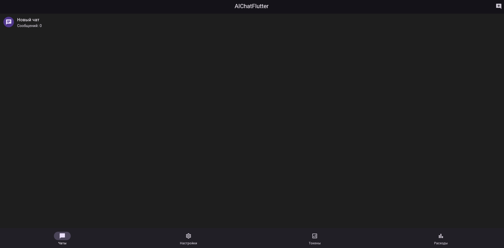
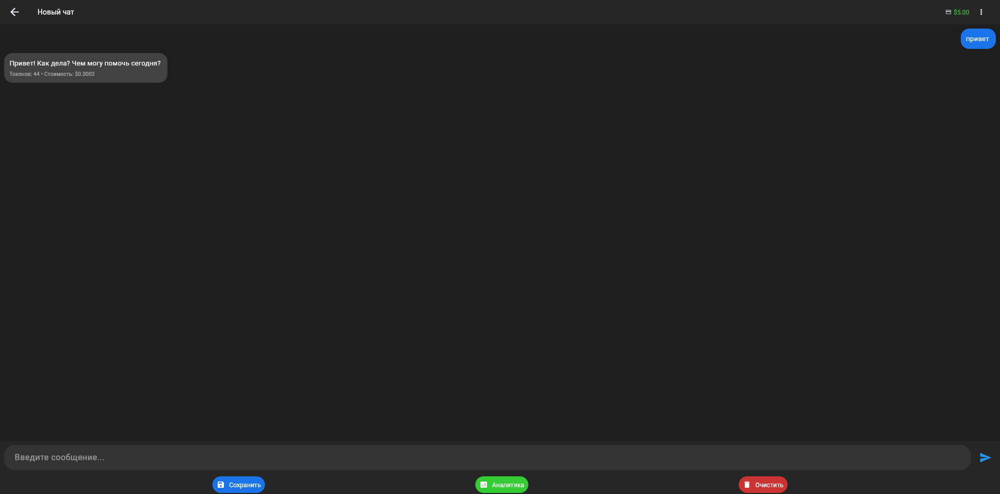
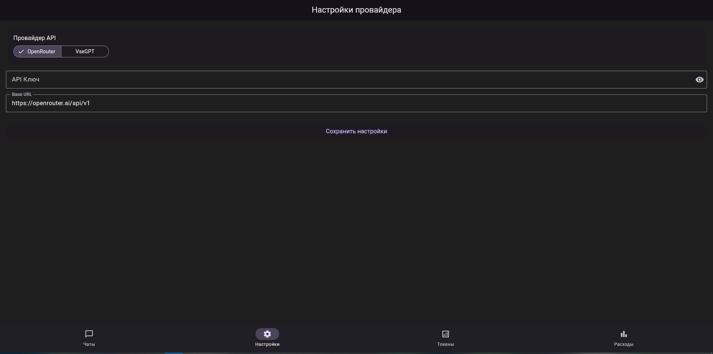
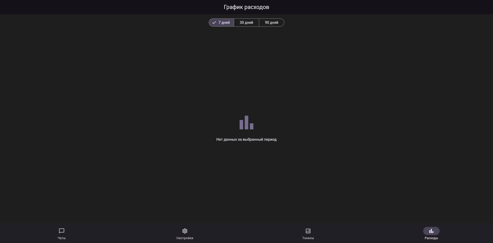
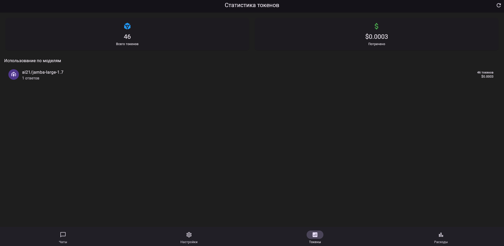
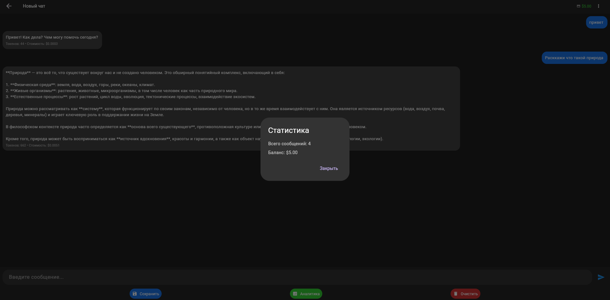

# AIChatFlutter-MultiPage
# 🤖 AIChatFlutter — Многостраничное ИИ-чат приложение

Мультиплатформенное приложение для общения с искусственным интеллектом с расширенной аналитикой использования.

## ✨ Возможности

### 📱 4 страницы приложения

| Страница | Описание |
|----------|----------|
| 🏠 **Главная** | Список чатов, создание/удаление диалогов |
| ⚙️ **Настройки** | Выбор провайдера (OpenRouter/VseGPT), ввод API ключей |
| 📊 **Статистика** | Анализ использования токенов по моделям |
| 📈 **График расходов** | Визуализация расходов по дням |

### 🔌 Поддержка API

- **OpenRouter.ai** — доступ к 100+ языковым моделям
- **VseGPT.ru** — оплата в рублях для пользователей из РФ

### 📊 Аналитика

- Подсчёт токенов для каждого сообщения
- Отслеживание стоимости запросов
- Статистика использования по моделям
- График расходов по дням

### 🛠 Технологии

- **Flutter** — кроссплатформенная разработка
- **Provider** — управление состоянием
- **fl_chart** — визуализация данных
- **SharedPreferences** — хранение настроек
- **SQLite** — локальная база данных

## 🚀 Быстрый старт

```bash
# Клонирование
git clone https://github.com/Sfinks322/AIChatFlutter-MultiPage.git
cd AIChatFlutter-MultiPage

# Установка зависимостей
flutter pub get

# Настройка .env
cp .env.example .env
# Отредактируйте .env, добавив ваш API ключ

# Запуск
flutter run -d chrome  # для веба
flutter run -d windows  # для Windows
## 📸 Скриншоты

### Главная и Чат

| Главная страница | Чат с ИИ |
|------------------|----------|
|  |  |

### Настройки и Статистика

| Настройки провайдера | Статистика токенов |
|----------------------|-------------------|
|  |  |

### Графики и Аналитика

| График расходов | Статистика в чате |
|----------------|-------------------|
|  |  |
